# 目录

- 什么是热修复
- 热修复框架分类
- 技术原理及特点
- 各框架对比图

## 一、什么是热修复

> 正常开发流程

版本1.0上线 --> 用户安装 --> 发现Bug --> 紧急修复 --> 重新发布版本1.1上线 --> 用户安装

> 热修复开发流程

版本1.0上线 --> 用户安装 --> 发现Bug --> 紧急修复 --> 打出补丁推送给用户 --> 用户自动拉取补丁修复

> 热修复优势

1. 无需重新发版
2. 用户无感知修复，无需下载最新的应用，代价小
3. 修复成功率高，把损失降到最低

> 修复什么

1. 代码修复
2. 资源修复
3. SO库修复

## 二、热修复框架分类

> 百花齐放，百家争鸣

item|from|open|function
--|--|--|--
Dexposed|阿里|开源|实时修复
Andfix|阿里|开源|实时修复
Hotfix|阿里|未开源|实时修复
Qzone超级补丁|QQ空间|未开源|冷启动修复
QFix|手Q团队|开源|冷启动修复
Robust|美团|开源|实时修复
Nuwa|大众点评|参考Qzone实现|开源|冷启动修复
RocooFix|百度金融|开源|冷启动修复
Aceso|美丽说蘑菇街|开源|实时修复
Amigo|饿了么|开源|冷启动修复
Tinker|微信|开源|冷启动修复
Sophix|阿里|未开源（商业收费）|实时修复+冷启动修复

> 按实现方式简单分类

native hook|java|混合
--|--|--
Dexposed|Qzone超级补丁|Sophix
Andfix|QFix|-
Hotfix|Robust|-
-|Nuwa|-
-|RocooFix|-
-|Aceso|-
-|Amigo|-
-|Tinker|-

> 按照进化的方式分类

native hook|java multidex|java hook|dex替换|混合/优化
-----------|-------------|---------|-------|-------
Dexposed|Qzone超级补丁|Robust|Amigo|Sophix
Andfix|QFix|Aceso|Tinker|-
Hotfix|Nuwa|-|-|-
-|RocooFix|-|-|-

## 三、技术原理及特点

### 3.1 阿里Dexposed-native解决方案

> 原理：

他的思想完全来源于Xposed框架，完美诠释了AOP编程，这里用到最核心的知识点就是在native层获取到指定方法的结构体，然后改变他的nativeFunc字段值，而这个值就是可以指定这个方法对应的native函数指针，所以先从Java层跳到native层，改变指定方法的nativeFunc值，然后在改变之后的函数中调用Java层的回调即可。实现了方法的拦截功能。

- 直接在native层进行方法的结构体信息对换，从而实现完美的方法新旧替换，从而实现热修复功能

- 基于开源框架Xposed实现，是一种AOP解决方案

- 只Hook App本身的进程，不需要Root权限

---
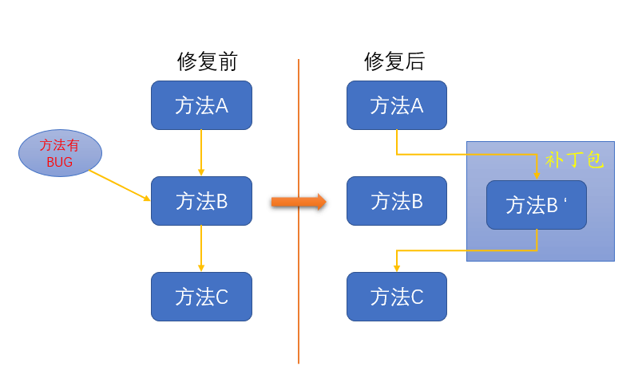

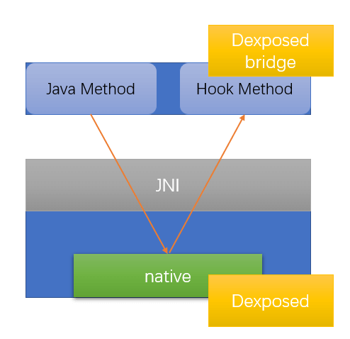

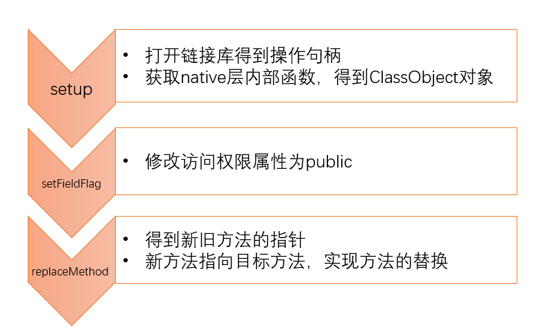

---

> 优点：

- 即时生效
- 不需要任何编译器的插桩或者代码改写，对正常运行不引入任何性能开销。这是AspectJ之类的框架没法比拟的优势
- 对所改写方法的性能开销也极低（微秒级），基本可以忽略不计
- 从工程的角度来看，热补丁仅仅是牛刀小试，它真正的威力在于『线上调试』
- 基于Xposed原理实现的AOP不仅可以hook自己的代码，还可以hook同进程的Android SDK代码，这也就可以让我们有能力在App中填上Google自己挖的坑

> 缺点：

- Dalvik上近乎完美，不支持ART（需要另外的实现方式），所以5.0以上不能用了
- 最大挑战在于稳定性与兼容性，而且native异常排查难度更高
- 由于无法增加变量与类等限制，无法做到功能发布级别

### 3.2 阿里AndFix – native解决方案

> 原理：

- 与Dexposed一样都基于开源框架Xposed实现，是一种AOP解决方案

> 优点：

- 即时生效
- 支持dalvik和art（AndFix supports Android version from 2.3 to 7.0, both ARM and X86 architecture, both Dalvik and ART runtime, both 32bit and 64bit.）
- 与Dexposed框架相比AndFix框架更加轻便好用，在进行热修复的过程中更加方便了

> 缺点：

- 面临稳定性与兼容性问题
- AndFix不支持新增方法，新增类，新增field等

> AndFix（Dexpsed）框架不稳定的原因（痛点）：

- 传统的底层替换方式，不论是Dexposed、Andfix或者其他安全界的Hook方式，都是直接依赖修改虚拟机方法实体的具体字段。例如：改Dalvik方法的jni函数指针、改类或者方法的访问权限等等。这样就带一个很严重的问题，由于Android是开源的，各个手机厂商都可以对代码进行改造，而Andfix里ArtMethod的结构是根据公开的Android源码中的结构写死的。如果某个厂商对这个ArtMethod结构进行修改，就和原先开源代码里的结构不一致，那么在这个修改过了的设备上，通用性的替换机制就会出问题。这便是不稳定的根源。

> 下面两种情况不适用即使修复框架：

1. 引起原有类中发生结构性变化的修改
2. 修复了的非静态方法会被反射调用

不过新增一个完整的，原先包里面不存在的新类时可以的，这个不受限制。

> 原因是：

- 一旦补丁中出现了方法的增加和减少，就会导致这个类以及整个Dex的方法数的变化。方法数的变化伴随着方法索引的变化，这样在访问方法时就无法正常的索引到正确的方法了。

### 3.3 QQ空间–Dex插桩方案（大众点评的Nuwa参考其实现并开源）

> 原理：

- 原理是Hook了ClassLoader.pathList.dexElements[]。因为ClassLoader的findClass是通过遍历dexElements[]中的dex来寻找类的。当然为了支持4.x的机型，需要打包的时候进行插桩。

- 越靠前的Dex优先被系统使用，基于类级别的修复

---
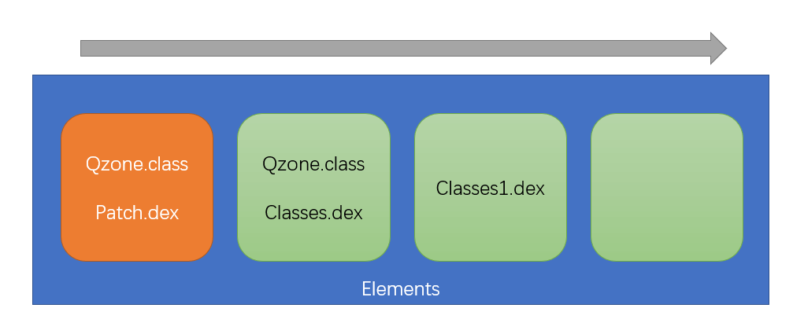

---

> 优点：

- 不需要考虑对dalvik虚拟机和art虚拟机做适配

- 代码是非侵入式的，对apk体积影响不大

> 缺点：

- 需要下次启动才会生效

- 最大挑战在于性能，即Dalvik平台存在插桩导致的性能损耗，Art平台由于地址偏移问题导致补丁包可能过大的问题

- 虚拟机在安装期间为类打上CLASS_ISPREVERIFIED标志是为了提高性能的，我们强制防止类被打上标志是否会影响性能？这里我们会做一下更加详细的性能测试．但是在大项目中拆分dex的问题已经比较严重，很多类都没有被打上这个标志。

> 插桩方案性能上的痛点：

- 如果仅仅把补丁类打入补丁包而不做任何处理的话，那么运行的时候就会抛出异常。原因是因为类被打上了`CCLASS_ISPREVERIFLED`标志，一般APK在第一次安装就会做这个操作。

- 要解决这个异常就得防止类被打上`CLASS_ISPREVERIFLED`标志，可是这样做又影响性能。

微信做过一此测试，分别采用优化和不优化两种方式做两种测试，分别采用插桩与不插桩两种方式，连续加载700个50行左右的类，统计如下：

-|不插桩|插桩
--|--|--
700个类|84ms|685ms
启动耗时|4934ms|7240ms

### 3.4 美团Robust – Instant Run 热插拔原理

> 原理：

- Robust插件对每个产品代码的每个函数都在编译打包阶段自动的插入了一段代码，插入过程对业务开发是完全透明

- 编译打包阶段自动为每个class都增加了一个类型为ChangeQuickRedirect的静态成员，而在每个方法前都插入了使用changeQuickRedirect相关的逻辑，当 changeQuickRedirect不为null时，可能会执行到accessDispatch从而替换掉之前老的逻辑，达到fix的目的。

---
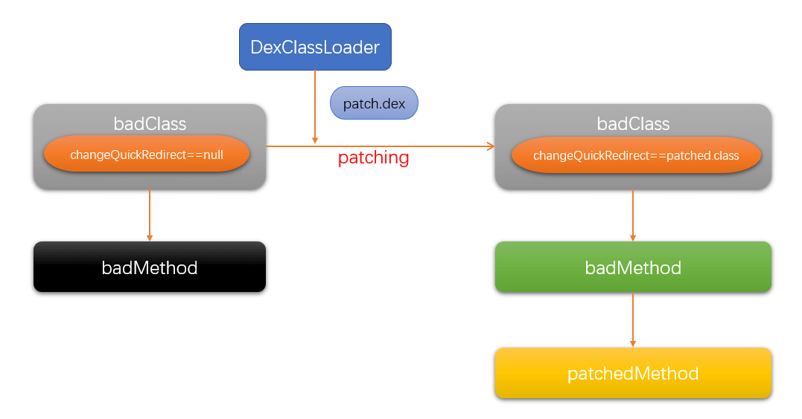

---

> 优点：

- 几乎不会影响性能（方法调用，冷启动）

- 支持Android2.3-8.x版本

- 高兼容性（Robust只是在正常的使用DexClassLoader）、高稳定性，修复成功率高达99.9%

- 补丁实时生效，不需要重新启动

- 支持方法级别的修复，包括静态方法

- 支持增加方法和类

- 支持ProGuard的混淆、内联、优化等操作

> 缺点：

- 代码是侵入式的，会在原有的类中加入相关代码

- so和资源的替换暂时不支持

- 会增大apk的体积，平均一个函数会比原来增加17.47个字节，10万个函数会增加1.67M。

- 会增加少量方法数，使用了Robust插件后，原来能被ProGuard内联的函数不能被内联了

### 3.5 微信Tinker

> 原理：

- 服务端做dex差量，将差量包下发到客户端，在ART模式的机型上本地跟原apk中的classes.dex做merge，merge成为一个新的merge.dex后将merge.dex插入pathClassLoader的dexElement，原理类同Q-Zone，为了实现差量包的最小化，Tinker自研了DexDiff/DexMerge算法。Tinker还支持资源和So包的更新，So补丁包使用BsDiff来生成，资源补丁包直接使用文件md5对比来生成，针对资源比较大的（默认大于100KB属于大文件）会使用BsDiff来对文件生成差量补丁。

---
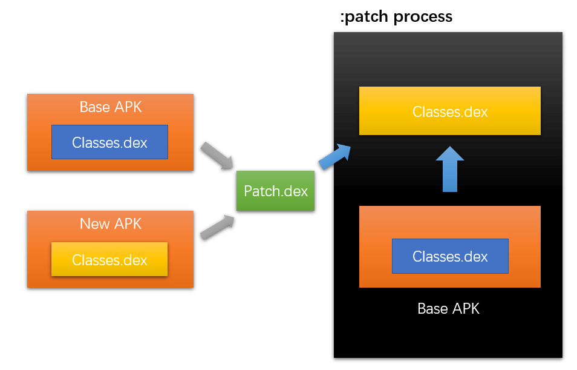

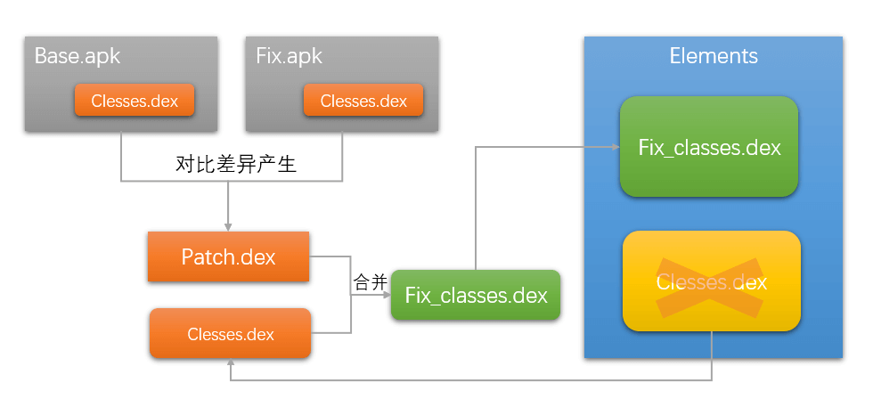

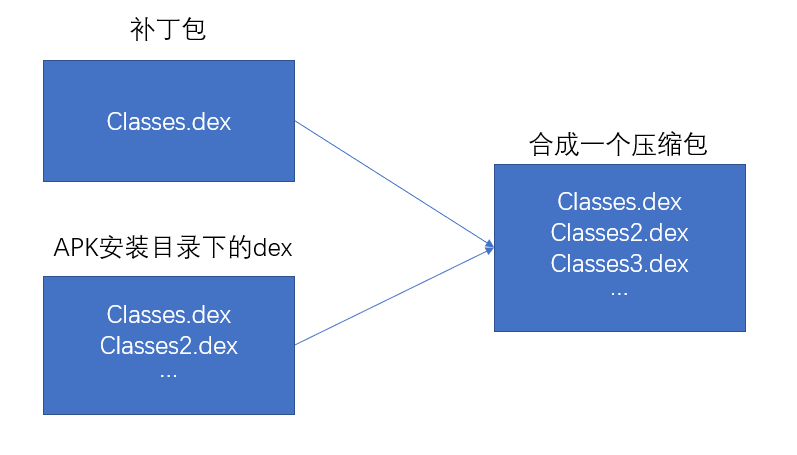

---

> 优点：

- 支持动态下发代码
- 支持替换So库以及资源

> 缺点：

- 不能即时生效，需要下次启动

> Tinker已知问题：

- Tinker不支持修改AndroidManifest.xml，Tinker不支持新增四大组件(1.9.0支持新增非export的Activity)；

- 由于Google Play的开发者条款限制，不建议在GP渠道动态更新代码；

- 在Android N上，补丁对应用启动时间有轻微的影响；

- 不支持部分三星android-21机型，加载补丁时会主动抛出"TinkerRuntimeException:checkDexInstall failed"；

- 对于资源替换，不支持修改remoteView。例如transition动画，notification icon以及桌面图标。

> Tinker性能痛点：

- Dex合并内存消耗在vm head上，容易OOM，最后导致合并失败。

- 如果本身app占用内存已经比较高，可能容易导致app本系统杀掉。

### 3.6 阿里Sophix

> 原理(双剑合璧)：

---
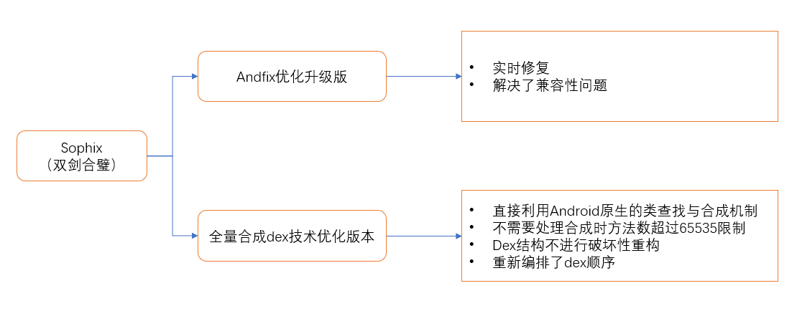

---

> 优化Andfix（突破底层结构差异，解决稳定性问题）：

- Andfix底层ArtMethod结构时采用内部变量一一替换，倒是这个各个厂商是会修改的，所以兼容性不好。

---
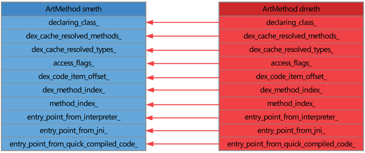

---

- Sophix改变了一下思路，采用整体替换方法结构，忽略底层实现，从而解决兼容稳定性问题。

---

---

> 突破QQ和Tinker的缺陷：

- QQ和Tinker的缺陷

\\ | QQZone | Tinker
--|--|--
原理|为了解决Dalvik下unexpected dex problem异常而采用插桩的方式，单独放一个帮助类在独立的dex中让其他类调用，阻止了类被打上`CLASS_ISPREVERIFLED`标志从而规避问题的出现。最后加载补丁dex得到dexFile对象作为参数构建一个Element对象插入到dexElements数组的最前面。|提供dex差量包，整体替换dex的方案。差量的方式给出patch.dex，然后将patch.dex与应用的classes.dex合并成一个完整的dex,完整dex加载得到的dexFile对象作为参数构建一个Element对象然后整体替换掉旧的dexElement数组。
优点|没有合成整包，产物比较小，比较灵活|自研dex差异算法，补丁包很小，dex merge成完整dex,Dalvik不影响加载性能，Art下也不存在必须包含父类/引用类的情况
缺点|Dalvik下影响加载性能，Art下类地址写死，导致必须包含父类引用，最后补丁包很大|dex合并内存消耗在vm heap上，容易OOM,最后导致dex合并失败。

> Sophix对dex的解决方案：

- Dalvik下采用阿里自研的全量dex方案：不是考虑把补丁包的dex插到所有dex前面（dex插桩），而是想办法在原理的dex中删除（只是删除了类的定义）补丁dex中存在的类，这样让系统查找类的时候在原来的dex中找不到，那么只有补丁中的dex加载到系统中，系统自然就会从补丁包中找到对应的类。

- Art下本质上虚拟机以及支持多dex的加载，Sophix的做法仅仅是把补丁dex作为主dex（classes.dex）而已，相当于重新组织了所有的dex文件：把补丁包的dex改名为classes.dex，以前apk的所有dex依次改为classes2.dex、classes3.dex … classesx.dex，如下图所示。

---

---

> 资源修复另辟蹊径：

- 常用方案（Instant Run技术）：这种方案的兼容问题在于替换AssetManager的地方。

1. 构造一个新的AssetManager，并通过反射调用addAssetPath,把这个完整的新资源包加入到AssetManager中。这样就得到了一个含有所有新资源的AssetManager。

2. 找到所有之前引用到原有AssetManager的地方，通过反射，把引用处替换为AssetManager。

- Sophix资源修复方案

1. 我们的方案没有直接使用InstantRun的技术，而是另辟蹊径，构造了一个package id为0x66的资源包，这个包里面只包含改变了的资源项，然后直接在原有的AssetManager中addAssetPath这个包就可以了。由于补丁包的package id为0x66,不与目前已经加载的0x7f冲突，因此直接加入到已有的AssetManager中就可以直接使用了。
2. 补丁包里面的资源，只包含原有的包里面没有而新的包里面有的新增资源，以及原有内容发生了改变的资源。并且，我们采用了更优雅的替换方式，直接在原有的AssetManager对象上进行析构和重构，这样所有原先对AssetManager对象的引用是没有发生改变的，所有就不需要像InstantRun那样进行繁琐的修改了。

> SO修复另辟蹊径：

- SO库的修复本质上是对native方法的修复和替换。

- 采用的是类似类修复反射注入方式。把补丁SO库的路径插入到nativeLibraryDirectorices数组的最前面，就能够达到加载SO库的时候是补丁SO库，而不是原来的SO库的目录，从而达到修复的目的。

- 采用这种方案完全是由Sophix在启动期间反射注入patch中的SO库。对开发者依然是透明的。不用像某些其他方案需要手动替换系统的System.load来实现替换的目的。

## 四、各框架对比

> 来自Tinker的对比

方案对比 |Tinker|QZone|Andfix|Robust
--|--|--|--|--
类替换|yes|yes|no|no
SO替换|yes|no|no|no
资源替换|yes|yes|no|no
全平台支持|yes|yes|no|yes
即时生效|no|no|yes|yes
性能损耗|较小|较小|较小|较小
补丁包大小|较小|较大|一般|一般
开发透明|yes|yes|no|no
复杂度|较低|较低|复杂|复杂
Rom体积|Dalvik较大|较小|较小|较小
成功率|较高|较高|一般|最高

> 来自Sophix的对比

方案对比|Sophix|Tinker|Amigo
--|--|--|--
DEX修复|同时支持及时修复和冷启动修复|冷启动修复|冷启动修复
资源更新|差量包，不用合成|差量包需要合成|差量包，不用合成
SO库更新|插桩实现，开发透明|接口替换，开发不透明|插桩实现，开发透明
性能损耗|低，仅冷启动情况下有些损耗|高，有合成操作|低，全量替换
生成补丁|直接选择已经编译好的新旧包在本地生成|编译新包时设置基线包|上传完整新包到服务器
补丁大小|小|小|大
接入成本|傻瓜式接入|复杂|一般
Android版本|全部支持|全部支持|全部支持
安全控制|加密传输及签名校验|加密传输及签名校验|加密传输及签名校验
服务端支持|支持服务端控制|支持服务端控制|支持服务端控制

---

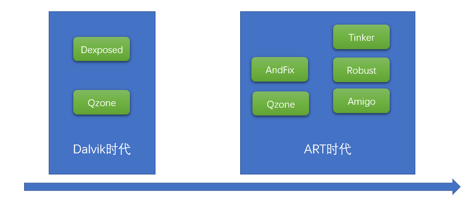

---

## 五、总结

- 如果不考虑增大apk的体积，只是简单的修复代码，不修复so和资源，选择Robust是最稳定的

- 否则的话选择Tinker是一个不错的方案。

- 虽然阿里Sophix横空出世，但是它不开源，而且商业收费，所以一般不是很赚钱的app选择收费的可能就很小了。不过它确实各方面都做了大量的优化。
